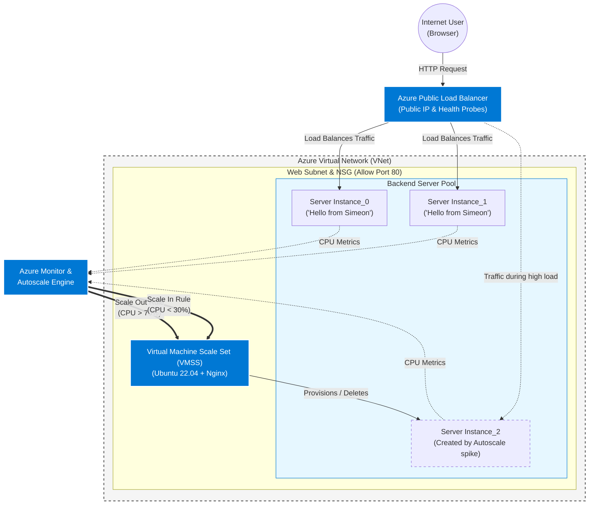

<h1>Highly Available Web App</h1>
In this project I designed a simple web app across a Virtual Machine Scale Set behind a load balancer. I wanted to touch on basic concepts of design, automation, high availability and elasticity using what I have learned from AZ-104 prep.   

 
<h2>Environments and Technologies Used</h2>

- Microsoft Azure
- Azure Load Balancer
- Virtual Machine Scale Sets (VMSS)
- Custom Script Extension (Linux)
- Azure Monitor & Insights
- Nginx Web Server
- Stress Utility

<h2>Operating Systems Used </h2>

- Ubuntu Server

<h2>Deployment and Configuration Steps</h2>

In this lab, I created a Virtual Machine Scale Set paired with an Azure Load Balancer. This setup ensures that if one server fails, the Load Balancer’s "Health Probes" will redirect traffic to healthy instances. Furthermore, I implemented Autoscale Rules that monitor CPU utilization, automatically adding or removing server capacity based on demand.

Configuring a highly available and elastic web app in Azure involves defining settings that control how traffic is distributed across multiple virtual machine instances and how the cluster reacts to performance demands.

I've learned a lot about business continuity and wanted to showcase how enterprises can ensure applications stay online and costs can be optimized.

I started by creating a Resource Group as a logical container for all resources.

