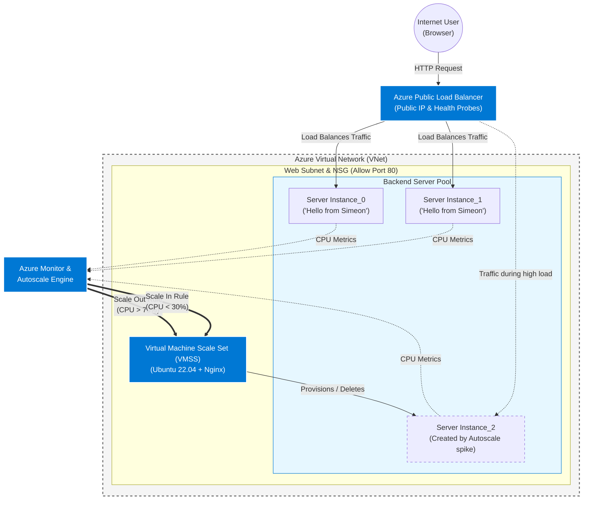

<h1>Highly Available Web App</h1>
In this project I designed a simple web app across a Virtual Machine Scale Set behind a load balancer. I wanted to touch on basic concepts of design, automation, high availability and elasticity using what I have learned from AZ-104 prep.   

