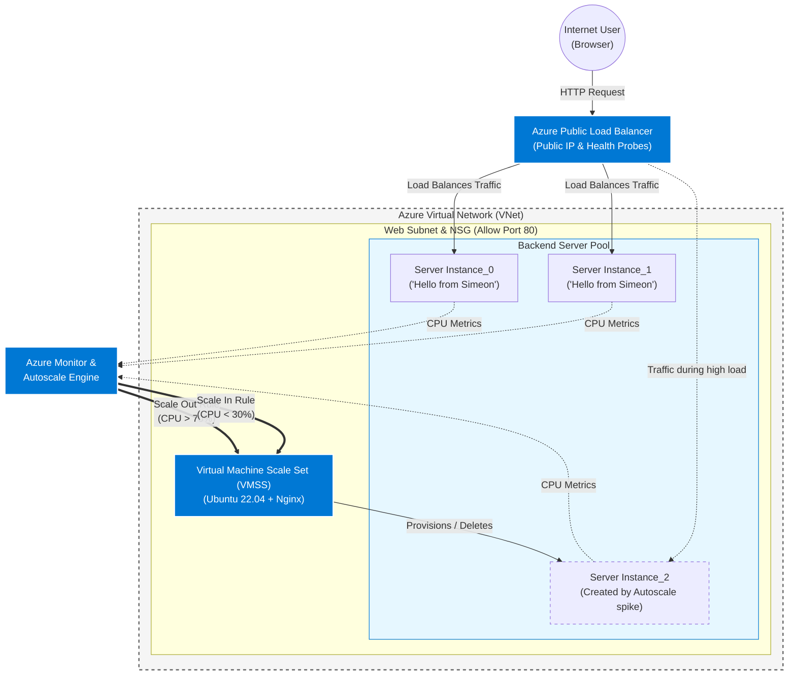

<h1>Highly Available Web App</h1>
In this project I designed a simple web app across a Virtual Machine Scale Set behind a load balancer. I wanted to touch on basic concepts of design, automation, high availability and elasticity using what I have learned from AZ-104 prep.   

 
<h2>Environments and Technologies Used</h2>

- Microsoft Azure
- Azure Load Balancer
- Virtual Machine Scale Sets (VMSS)
- Custom Script Extension (Linux)
- Nginx Web Server
- Azure Montior & Insights
- Stress Utility

<h2>Operating Systems Used </h2>

- Ubuntu Server

<h2>Deployment and Configuration Steps</h2>

In this lab, I created a Virtual Machine Scale Set paired with an Azure Load Balancer. This setup ensures that if one server fails, the Load Balancer’s "Health Probes" will redirect traffic to healthy instances. Furthermore, I implemented Autoscale Rules that monitor CPU utilization, automatically adding or removing server capacity based on demand.

Configuring a highly available and elastic web app in Azure involves defining settings that control how traffic is distributed across multiple virtual machine instances and how the cluster reacts to performance demands.

I've learned a lot about business continuity and wanted to showcase how enterprises can ensure applications stay online and costs can be optimized.

I started by creating a Resource Group as a logical container for all resources.

  
I created a Virtual Network and a specific subnet for my web servers.

 
  
IPv4 address space defined with a subnet `172.16.0.0/24`

  
For my web app I configured a Virtual Machine Scale Set (VMSS) with an Ubuntu Server image and two instances. Since I want these machines to run the same workload, I choose `Uniform` for the Orchestration Mode.

  
On the Networking tab, I chose the virtual network `tws_highlyavailable_rg` to keep all my resources in the same network and
I edited the network interface to choose the subnet I created when configuring the virtual network.

  
Here is the following result. The Overview page shows that I have two instances of my VM. Next, I will upload a script that will install the NGINX web server as well as some custom text representing our web app.

  
To do this I will navigated to Extensions and Applications under the Settings tab within the VMSS resource. The extension I am installing is called Custom Script for Linux.

  
I prepared a text file that contains a script that will install NGINX as well as display text saying "Hello from Simeon" and list the VM instance that is running. To use this in Custom Script I uploaded a file called `tws_nginx.sh` into  a storage container. 

Browsing and choosing that file, then making sure the command matches my file name in this instance `sh tws_nginx.sh`, I'm telling Azure to download this script onto my VMs and execute it. This automates the installation of the web server on my VMs so I don't have to do it individually.

A few more steps before this is going to work. I need to make sure that our Network Security Group (NSG) is allowing inbound web traffic. We are installing NGINX web server on our VMs but currently we will not be able to access this server from the internet. So I created an inbound rule allowing port 80 (HTTP) traffic to our network.

VMSS is currently set to update manually so to see the changes I made, I go to Instances and run the upgrade to the latest model.
 

  
Finally I can test the public IP address and see that the server is running and I can access it via the web. Note the server name matches the computer name.

  
Currently, both instances of my VMSS can only be accessed if one has their public IP address. I want these VMs to run as a highly available, scalable set. In order to do this I will put the VMSS behind a load balancer. A load balancer will put the instances behind one public IP and will use a health probe to gauge and determine how to route traffic.

This ensures that if one of our instances goes offline, our web app is still accessible. This is a common staple in building a scalable architecture ensuring availability of resources no matter the circumstance.

I configured a load balancer on port 80.

  
The frontend of the load balancer is the entry point. Traffic comes through the Frontend IP and is distributed to the backend pool.

  
The backend pool is the collection of servers, VMs, or resources that receive and process incoming traffic from the load balancer.

  
The health probe is looking at backend instances to see if they are "healthy" it does this by sending requests. If an instance in the pool is unhealthy, the load balancer will stop sending traffic there.

  
Lastly, the load balancing rules which is where you set all the components that I mentioned previously.

With the load balancer configured, I can use its Public IP in order to gain access to the web server.

The load balancer connected me to `webscale_0` (tws_highl000000). Now I am going to stop this machine which won't allow me access to this specific VM instance. However, since we have placed two instances in this scale set and both sit behind the load balancer, I should be able to refresh the page and still connect to the server.

I wanted to add another component to this project adding an autoscale rule to add another server instance if the CPU hits  a certain threshold. This is a key component to efficient scaling of resources and something that is common in any business with a cloud environment.

I was able to set up my VMSS to scale up but due to the limitations of my Azure trial, my third VM failed.

Here is my walkthrough anyway.

Under the Scaling tab in my VMSS resource, their are two options to scale resources. Manual Scale keeps a fixed instace count, where Autoscale can be configured to scale on metrics.

I added a few rules that would trigger scaling up or down the number of VM instances available.

Adding an instance when CPU goes above 70% average over 5 minutes.

And removing an instance when the CPU goes below 30% average over 5 minutes.

You can also see that I set Instance Limits. The minimum, maximum and default number of instances that will be running.

In order to test my new scale settings, I ran a stress test on one of the instances. This sets the CPU at 100% and will trigger the autoscale rule to set in.

Unfortunately this is where my lab ended. My Azure trial subscription would not allow my VMSS to provision the third VM when CPU hit my threshold set. The trial only allows for 3 public IPs which I already had.

I did take a screenshot of the activity log showing that the scale up was initiated. It also shows where the operation failed as it would put me over my VM quota.

In a real environment I could request an increase in quota but for this lab I just wanted to get the basic point across.

Normally you would see rhe third instance provision and the load balancer would have another option to route traffic. When the average CPU drops below 30% again. The third instance would deprovision.

Thanks for taking your time to go through my lab!

-Simeon-

